# Spam Classifier MLOps on AWS

An end-to-end MLOps pipeline built entirely on AWS Free Tier ($0 cost).
Covers the full ML lifecycle: data ingestion, model training, REST API 
deployment, CI/CD automation, drift detection, and automatic retraining.

## Architecture
```
SMS/Enron/Lingspam Data
        ↓
    Amazon S3
        ↓
SageMaker Notebook (Naive Bayes + TF-IDF)
        ↓
    Model → S3
        ↓
Lambda + API Gateway (REST API)
        ↓
CloudWatch (Monitoring + Drift Alerts)
        ↓
CodePipeline + CodeBuild (Auto-retraining on GitHub push)
```

## What This Project Demonstrates

- Training a Naive Bayes classifier on real SMS spam data
- Deploying a live REST API using AWS Lambda + API Gateway
- CI/CD pipeline that automatically retrains on every GitHub push
- Real-world drift simulation using Enron emails (confidence drops from ~95% to ~70%)
- KS-test based drift detection pushing metrics to CloudWatch
- Automatic retraining on combined dataset and model recovery

## Project Structure
```
mlops/
├── train/
│   └── train_validate.ipynb    # Training + evaluation notebook
├── monitor/
│   └── drift_detector.ipynb    # Drift detection using KS test
├── lambda/
│   └── lambda_function.py      # Lambda inference handler
├── buildspec.yml               # CodeBuild CI/CD config
├── requirements.txt            # Python dependencies
└── README.md
```

## AWS Services Used

| Service | Purpose | Cost |
|---|---|---|
| S3 | Data + model storage | Free tier |
| SageMaker | Model training notebook | Free tier |
| Lambda | Model inference API | Free tier |
| API Gateway | REST endpoint | Free tier |
| CodePipeline | CI/CD orchestration | Free tier |
| CodeBuild | Automated retraining | Free tier |
| CloudWatch | Monitoring + drift alerts | Free tier |

## Datasets

| Dataset | Size | Role |
|---|---|---|
| SMS Spam Collection (UCI) | 5,574 messages | Initial training |
| Enron Email Dataset | ~3,000 messages | Drift simulation batch 1 |
| Lingspam Dataset | ~2,893 messages | Drift simulation batch 2 |

## Model Performance

- Algorithm: Naive Bayes + TF-IDF (unigrams + bigrams)
- Accuracy: ~97-98% on SMS test set
- Baseline confidence: ~0.93-0.95
- Confidence after Enron drift: ~0.65-0.75
- Confidence after retraining on combined data: ~0.88-0.94

## API Usage

Send a POST request to the deployed endpoint:
```bash
curl -X POST https://YOUR_API_URL/predict \
  -H 'Content-Type: application/json' \
  -d '{"text": "Congratulations! You won a free iPhone. Click here now!"}'
```

Response:
```json
{
  "prediction": "spam",
  "confidence": 0.9347,
  "is_spam": true
}
```

## Drift Detection

The drift detector compares confidence score distributions between 
the baseline (SMS) and new production batches using the 
Kolmogorov-Smirnov test. If p-value < 0.05 or mean confidence 
drops below 0.80, drift is flagged and a CloudWatch metric is pushed.
```
Baseline SMS confidence:  ~0.94
Enron batch confidence:   ~0.70  ← drift detected
After retraining (v2):    ~0.91  ← model recovered
```

## CI/CD Pipeline

Every push to the main branch automatically:
1. Triggers CodePipeline
2. CodeBuild executes the training notebook
3. New model saved to S3
4. Lambda loads new model on next request

## Setup

1. Create an AWS account and configure CLI:
```bash
aws configure
```

2. Create S3 bucket and upload datasets

3. Open SageMaker notebook and run `train/train_validate.ipynb`

4. Deploy Lambda function with `lambda/lambda_function.py`

5. Connect CodePipeline to this GitHub repo

6. Run `monitor/drift_detector.ipynb` after sending new data batches

## Total AWS Cost

$0 — built entirely within AWS Free Tier limits.
## Architecture

